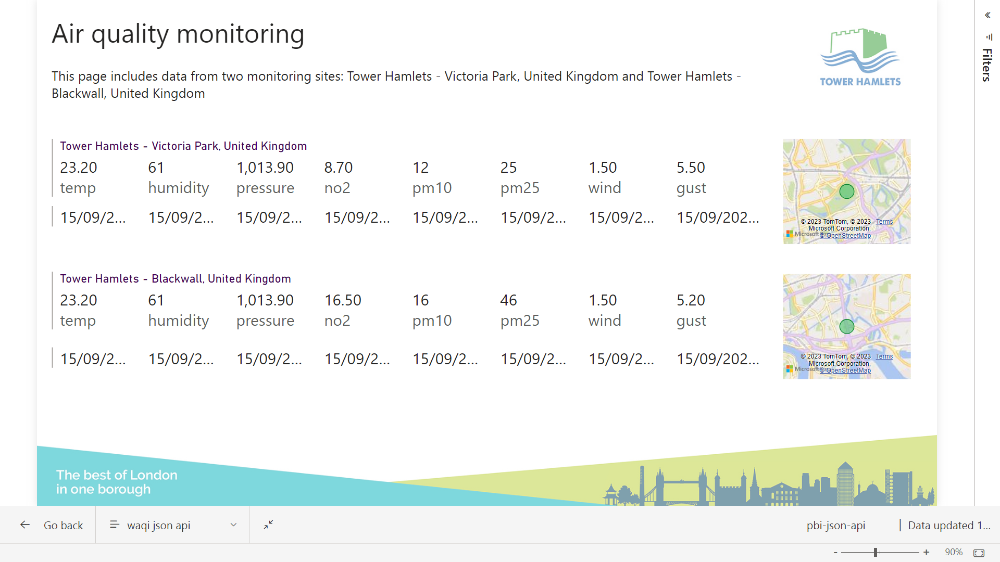
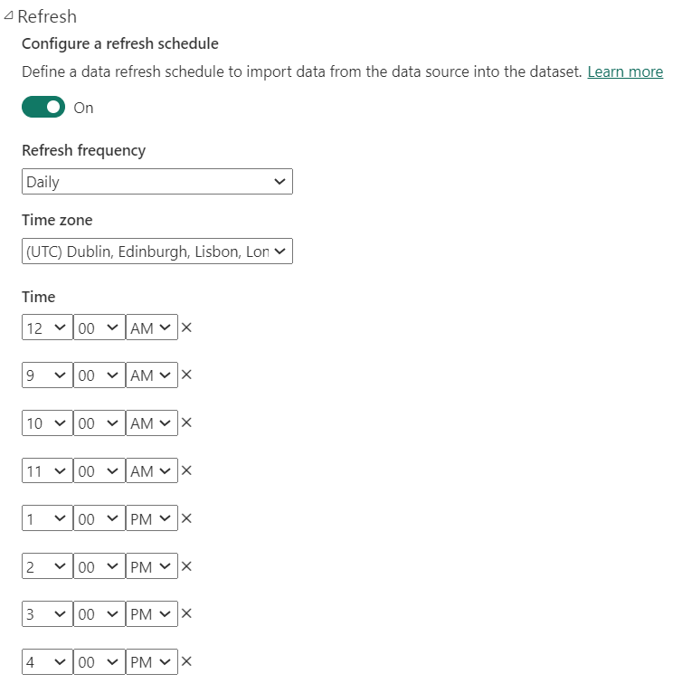

# pbi-json-api
> a demo dashboard that pulls data from a JSON api endpoint

[](https://app.powerbi.com/groups/0b4d5a6e-774c-4f9c-bc42-fbcb35e1c483/reports/8b55434a-ed08-42c1-9761-a35e6437afdc/ReportSection?experience=power-bi)

in this instance the data was found in json pulled by pages for [victoria park](https://aqicn.org/city/united-kingdom/tower-hamlets-victoria-park/) ([json](https://api.waqi.info/api/feed/@14598/aqi.json)) and [blackwall](https://aqicn.org/city/united-kingdom/tower-hamlets-blackwall/) ([json](https://api2.waqi.info/api/feed/@7948/aqi.json))

the api is undocumented, but relatively intuitive; a truncated sample is shown below, with the `obs` and `forecast` sections removed for brevity:

```json
{
  "dt": "610.568µs",
  "rxs": {
    "obs": [
      {
        "msg": {
          "aqi": 25,
          "idx": 14598,
          "attributions": [
            {
              "url": "http://uk-air.defra.gov.uk/",
              "name": "UK-AIR, air quality information resource - Defra, UK",
              "logo": "UK-Department-for-environment-food-and-rural-affairs.png"
            },
            {
              "url": "https://londonair.org.uk/",
              "name": "London Air Quality Network - Environmental Research Group, King's College London",
              "logo": "UK-London-Kings-College.png"
            },
            {
              "url": "https://waqi.info/",
              "name": "World Air Quality Index Project"
            }
          ],
          "city": {
            "geo": [
              51.5405194915241,
              -0.033307388878
            ],
            "name": "Tower Hamlets - Victoria Park, United Kingdom",
            "url": "https://aqicn.org/city/united-kingdom/tower-hamlets-victoria-park"
          },
          "dominentpol": "pm25",
          "iaqi": {
            "h": {
              "v": 60,
              "t": "2023-09-15 13:00:00"
            },
            "no2": {
              "v": 14.7,
              "t": "2023-09-15 11:00:00"
            },
            "p": {
              "v": 1014.1,
              "t": "2023-09-15 13:00:00"
            },
            "pm10": {
              "v": 12,
              "t": "2023-09-15 11:00:00"
            },
            "pm25": {
              "v": 25,
              "t": "2023-09-15 11:00:00"
            },
            "t": {
              "v": 22.7,
              "t": "2023-09-15 13:00:00"
            },
            "w": {
              "v": 2,
              "t": "2023-09-15 13:00:00"
            },
            "wg": {
              "v": 5,
              "t": "2023-09-15 13:00:00"
            }
          },
          "time": {
            "s": "2023-09-15 11:00:00",
            "tz": "+01:00",
            "v": 1694775600,
            "iso": "2023-09-15T11:00:00+01:00"
          },
          "obs": {...},
          "forecast": {...},
          "xsync": {
            "gen": 1694779365
          }
        },
        "status": "ok",
        "cached": "2m39.770497357s"
      }
    ],
    "status": "ok",
    "ver": "1"
  }
}
```

adding these as data sources in pbi (Aug 2023 version) was quite easy, it automated most of the flattening process, turning the json blob into a wide table comprised of a single row, mainly making use of the `Table.ExpandRecordColumn` function to break out json object properties into named columns.

the out-of-the-box powerquery was only modified in one place, to split a json array into named longitude and latitude columns via transform, split, and rename calls:

```m
#"Extracted Values" = Table.TransformColumns(#"Expanded rxs.obs.msg.city", {"rxs.obs.msg.city.geo", each Text.Combine(List.Transform(_, Text.From), ","), type text}),
#"Split Column by Delimiter" = Table.SplitColumn(#"Extracted Values", "rxs.obs.msg.city.geo", Splitter.SplitTextByDelimiter(",", QuoteStyle.Csv), {"rxs.obs.msg.city.geo.1", "rxs.obs.msg.city.geo.2"}),
#"Renamed Columns" = Table.RenameColumns(#"Split Column by Delimiter",{{"rxs.obs.msg.city.geo.1", "latitude"}, {"rxs.obs.msg.city.geo.2", "longitude"}}),
```

the resulting datasets were then piped into "multi row card" and map visuals in the board itself.

## scheduling updates to a published dataset

[](https://go.microsoft.com/fwlink/?linkid=839732)

## use of pbi-tools

this project uses [pbi.tools](https://pbi.tools) to bring reliable versioning and documentation support.

a few of the more useful commands are explained below:

`pbi-tools extract pbi-json-api.pbix`

> Extract the contents of a PBIX/PBIT file into a folder structure suitable for source control.

...you can then work on powerquery directly in a code editor, useful for managing complex products where you need to find/replace across multiple pages.

`pbi-tools compile pbi-json-api -overwrite -format PBIT`

> re-compile a PBIT file from modified sources in the specified folder

...having fixed up your powerqueries, you can recompile these back into a PBIT, which in turn you can open in pbi, ready to save as a PBIX report...

`pbi-tools launch-pbi pbi-json-api.pbit`

> open a pbit in pbi

...this file can then be saved as pbix format and published!
